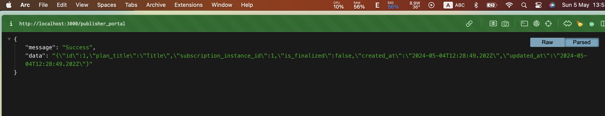

# Modular Monolith proposal

This folder structure is inspired by [all_you_need_is_rails_engine](https://github.com/pinzonjulian/all_you_need_is_rails_engines), only 2 modules `entitlement` and `publisher_portal` are modularized at `subsystems` folder. In `app` folder, we still have `getLago` which is the same with original `getLago` repo.

## GetLago+ DDD checklist

- [x] Multiple modules structure
- [x] Migration for each module
- [ ] Test and how to run tests
- [ ] Module own routes.rb file (unable to mount separate engines and using subdomain)
- [x] Set up `packwerk` for boundaries
- [x] How to sync get_lago with original repo
- [x] Multiple databases

## Problems

1. Can not separate `routes.rb` files for each modules (**entitlement** and **publisher_portal**).

```rb
Rails.application.routes.draw do
  mount Sidekiq::Web => '/sidekiq' if ENV['LAGO_SIDEKIQ_WEB'] == 'true'

  mount GraphiQL::Rails::Engine, at: '/graphiql', graphql_path: '/graphql' if Rails.env.development?

  get 'entitlement', to: 'policy#index'

  # mount Entitlement::Engine, at: '/entitlement'

  get 'publisher_portal', to: 'publisher#index'

  post '/graphql', to: 'graphql#execute'
  ...
```

The above code is excerpt from (routes.rb)[config/routes.rb] file. I have yet been able to separate `routes.rb` file and mount individual engines like what they did in [this sample](https://github.com/pinzonjulian/all_you_need_is_rails_engines)

2. Most modular monolith only isolate module at the code level but not database. There is a certain degree of anxiety for developers to move forward with modularity at database level by utilizing multiple database. What impact this structure would make for migration and deployment are still unknown?

## Boundaries by packwerk

- In your terminal run this command

```sh
packwerk check
```

This error message would appear

It can be fixed by update file `components/entitlement/package.yml` with this code

```yml
enforce_privacy: true
enforce_dependencies: true

dependencies:
  - components/base
  - components/get_lago
```

More details about how to use `packwerk` [can be found here](https://github.com/Shopify/packwerk/blob/main/USAGE.md#Enforcing-dependency-boundary)

## Set up multiple database

Setting up multiple database for modular monolith app is very similar to standard Ruby app. In this repo, there 2 databases `lagu` and `publisher_portal` already set up. `lagu` is consider the primary database so this is migration command for `lagu`

```sh
bin/rails db:migrate:primary
```

And this is the command for `publisher_portal`

```sh
bin/rails db:migrate:publisher_portal
```

## Migration for each module

Generating migration for each module (E.g: entitlement, publisher_portal) is not really an issue whey they share the same database. In this app, we're using 2 database `lagu` and `publisher_portal` so to make any change to any database, we must target exactly what database we're trying to make the change.
Let's say we want to create a new table called `subscription_charges` for `publisher_portal` database. The command should be

```sh
rails generate model SubscriptionCharge id:primary_key plan_title:string subscription_instance_id:integer is_finalized:boolean --database=publisher_portal
```

Then we need to run migration exactly for `publisher_portal` db

```sh
rails db:migrate:publisher_portal
```

To test if we have done it right. Let's insert new data to `subscription_charges` table from rails console

```sh
rails console
```

```sh
SubscriptionCharge.create(plan_title: 'Title', subscription_instance_id: 1, is_finalized: false)
```

After that visit `http://localhost:3000/publisher_porta`, you should see a screen like this


