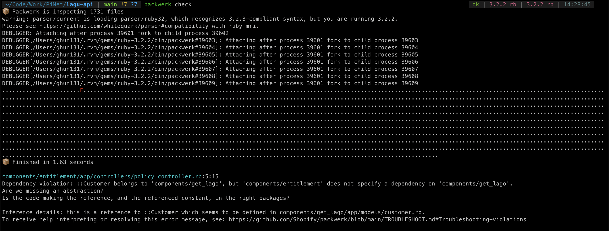

This folder structure is inspired by [all_you_need_is_rails_engine](https://github.com/pinzonjulian/all_you_need_is_rails_engines), only 2 modules `entitlement` and `publisher_portal` are modularized at `subsystems` folder. In `app` folder, we still have `getLago` which is the same with original `getLago` repo.

# GetLago+ DDD checklist

- [x] Multiple modules structure
- [ ] Migration for each module
- [ ] Test and how to run tests
- [ ] Module own routes.rb file (unable to mount separate engines and using subdomain)
- [x] Set up `packwerk` for boundaries
- [x] How to sync get_lago with original repo
- [ ] Multiple databases

## Problems

1. Can not separate `routes.rb` files for each modules (**entitlement** and **publisher_portal**).

```rb
Rails.application.routes.draw do
  mount Sidekiq::Web => '/sidekiq' if ENV['LAGO_SIDEKIQ_WEB'] == 'true'

  mount GraphiQL::Rails::Engine, at: '/graphiql', graphql_path: '/graphql' if Rails.env.development?

  get 'entitlement', to: 'policy#index'

  # mount Entitlement::Engine, at: '/entitlement'

  get 'publisher_portal', to: 'publisher#index'

  post '/graphql', to: 'graphql#execute'
  ...
```

The above code is excerpt from (routes.rb)[config/routes.rb] file. I have yet been able to separate `routes.rb` file and mount individual engines like what they did in [this sample](https://github.com/pinzonjulian/all_you_need_is_rails_engines)

2. Most modular monolith is only isolate module at the server level but not database. I am not sure that multiple databases can work well with this code structure and how would we do migration with different databases

## Boundaries by packwerk

- In your terminal run this command

```sh
packwerk check
```

This error message would appear

It can be fixed by update file `components/entitlement/package.yml` with this code

```yml
enforce_privacy: true
enforce_dependencies: true

dependencies:
  - components/base
  - components/get_lago
```

More details about how to use `packwerk` [can be found here](https://github.com/Shopify/packwerk/blob/main/USAGE.md#Enforcing-dependency-boundary)
